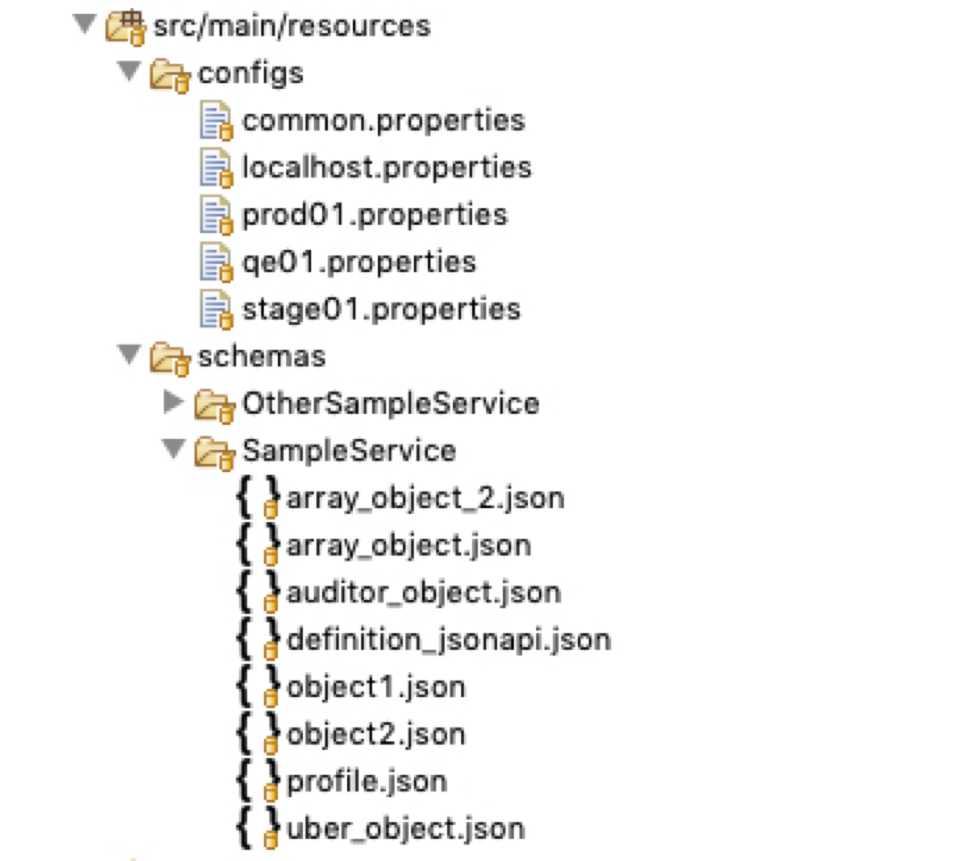
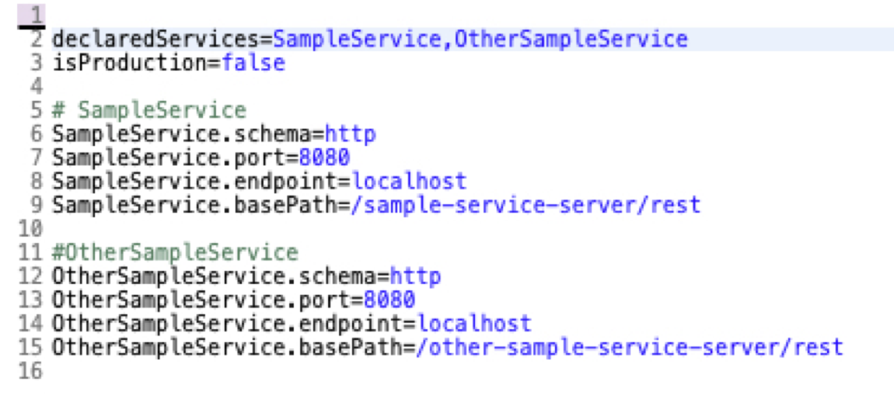

<br>
<br>
 Speed the development of your automated REST API tests across microservices and end-to-end workflows.

# Overview
 

Ride is a service-agnostic, modular, extensible Java REST API automation framework. It speeds test development by:

* Abstracting repetitive code
* Standardizing service-specific calls
* Integrating testing across microservices and workflows
* Auto Generating json payloads from schema
* Auto-Fuzzing payload defined by arbitrary json schema
* Runing Perfomance tests against entire workflows without re-writing your test code.

# Current

<table>
    <tr>
        <td>Ride</td>
        <td>2.0.0</td>
    </tr>
</table>


# Getting Started

While Ride can be used as is, it is more powerful when extended for your specific services.  Extending is consists of three steps:
* Providing config information, in the form of environment property files and payload schemas
* Creating extensions from the core API Controller and ModelObject, which consume the config info you provide
* Writing tests using the configured extension(s)

To begin to building your test extention, create a standard java project in the IDE/Build Tool of choice (the samples shown here are in [Eclipse](https://www.eclipse.org/ide/) using [Maven](https://maven.apache.org/)).

## Configuration

With your base extension project created, provide Ride with the information discussed above on how to talk to your service: 
* Environment config files (*.properties) to target your service
* JSON schemas which describe the payloads sent to the service  

These should be placed in folders named as shown below in your project main resources (you may want to have a centralized, shareable resources jar - see samples):



### Target Environments

Ride is designed so that multiple environments can be indicated, and multiple services for each environment can be defined.  In the example below, 2 services are defined for *localhost*___.properties___ (how to target them is discussed a bit further down).  They will be consumed by your extension:



The advantage here is that if you have multiple services (even multiple extensions), you can run complete inter-service (end-to-end) flows targeting all service (using their respective test extensions) in one test.

### Payload Definitions

Your service payloads are defined by standard json schema, and are organized into the services they target by folders as shown above.

## Extending

Once you have your schemas and environment properties files setup, you can begin to create your extension.  This is done by [extending](https://github.com/adobe/ride/blob/develop/sample/sample-service-extension/src/main/java/com/adobe/ride/sample/cloud_objects/SampleServiceUberObject.java#L32) the [ModelObject](https://github.com/adobe/ride/blob/develop/utilities/ride-model-util/src/main/java/com/adobe/ride/utilities/model/ModelObject.java)  and [extending](https://github.com/adobe/ride/blob/develop/sample/sample-service-extension/src/main/java/com/adobe/ride/sample/core/SampleServiceController.java#L33) the [RestApiController](https://github.com/adobe/ride/blob/develop/core/src/main/java/com/adobe/ride/core/controllers/RestApiController.java)

An examination of the pom files in those two sample projects will given you an idea of the dependencies you will need to identify in order to build and use your extension.  You build your extension as you would any java project.  Below is an example using Maven

## Writing Tests


Once you have created and built your extension, you can begin using is tests which abstract away a significant portion repetitive code, as is shown below:

```
  @Test(groups = {"smoke", "acceptance"})
  public void testAuthenticatedCalltoServer() {
    String itemName = UUID.randomUUID().toString();

    // Create  Object
    SampleServiceObject1 testObject = new SampleServiceObject1(itemName, false);
    
    // 
    SampleServiceController.createOrUpdateObject(testObject.getObjectPath(), testObject,
        ExpectedResponse.CREATED_RESPONSE, true);
  }
```

## Running Your Tests

When you are ready to run your tests from the command line, it will look something like this (standard maven command line syntax):

``` 
mvn clean verify -Dtarget=prod01
```

If you do not specify a target, 'localhost' is the default and will be used by your extension.

## Fuzzing

With a few simple lines of code, you can generate many negative tests against the JSON payload sent to your service.  Ride internally maintains arrays of non-strings, SQL injection strings, No SQL injection strings, and localized strings to teste against the definitions in your schema.  This fuzzing walks the entire hiearchy of any arbitrary schema and tests each node in isolation ([sample code](https://github.com/adobe/ride/blob/develop/sample/sample-service-tests/src/test/java/com/adobe/ride/sample/Basic_FuzzTest_IT.java)):

```
@Factory
  public Object[] fuzzObjectMetadata_IT() throws Exception {
    String itemName = UUID.randomUUID().toString();
    SampleServiceObject1 object1 = new SampleServiceObject1(itemName, false);
    return new Object[] {new MetadataFuzzer(Service.SAMPLE_SERVICE.toString(), object1)};
  }


```

## Performance Testing

Part of the power of Ride is that once you have your extension written, you can use it for fuzzing (as shown above), but also for performance testing.  The performance library in Ride is based on Gatling, so while there is a bit of setup, and a bit of a shift in syntax to scala, you are still able to setup tests that measure performance for full flows of data withough having to rewrite what you've already created in your extension - [sample Ride performance test](https://github.com/adobe/ride/blob/develop/sample/sample-service-performance-tests/src/main/scala/com/adobe/ride/sample/performance/SampleServiceBasicRunner.scala)


## Additional Documentation

There are a number of supporting Informational documents in this repo which will help you utilize and perhaps contribute to Ride.


* [Architecture (former main readme)](https://github.com/adobe/ride/blob/develop/Architecture.md)
* [Quick Start](https://github.com/adobe/ride/blob/develop/QuickStart.md)
* [Usage](https://github.com/adobe/ride/blob/develop/Usage.md)
* [Using Authentication](https://github.com/adobe/ride/blob/develop/UsingAuthentiation.md)


