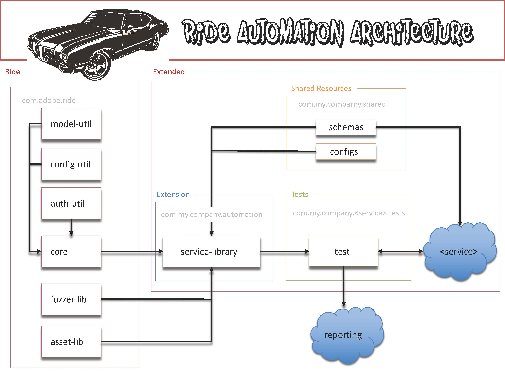

* [Overview](#overview)
* [Related documents](#related-documents)
 * [Repositories](#repositories)
 * [Settings](#settings)
* [Modules](#modules)
* [Design](#design)
 * [Key Concepts](#key-concepts)
 * [Abstraction and Optimization](#abstraction-and-optimization)
 * [Structure and Modularity](#structure-and-modularity)
 * [Components and Extensibility](#components-and-extensibility)
 * [Building and Release Versions](#building-and-release-versions)
 * [Core Extensions](#core-extensions)
 * [SharedResources](#sharedresources)
 * [Reporting](#reporting)
 * [Usage](#usage)
 * [TestNG](testng)
* [Final Thoughts](#final-thoughts)

# Overview

Adobe Ride is a service-agnostic, modular, extensible REST API Test Automation Framework built on top of already industry-standard test frameworks and tools such as [Rest-Assured](http://rest-assured.io/), [TestNG](https://testng.org/doc/index.html), [FGE](https://github.com/java-json-tools/json-schema-validator), and [Gatling](https://gatling.io/).  The goal of the framework is to speed development of tests and validation of services across the REST testing spectrum by a number of means:
* Abstracting repetitive code
* Standardizing calls within the framework
* Modular and Extensible design
* Common source base for updates that can be leveraged among tests across products. 

Adobe Ride has already seen heavy use in a previous Adobe projects, and the intent is to utilize the experience there, leverage lessons learned, and allow the community to in turn help develop it to make it more robust.

You use Adobe ride by extending it in three primary ways:
* Extending it's model-util to model rapidly generate and easily manipulate call payload data.
* Provide some config information to point your tests at any endpoint that is deployed.
* Extend the Ride core to easily fire REST calls against your service API and build intensive real-world test cases.

There are additional test options avaialble as well:
* Use the fuzzer-lib to quickly run tedious negative testing against the nodes in your JSON payload.
* Use the performance-lib to quickly gather metrics on calls to your service and across services.

## Related documents

| Document   | Link |
| -------------  | ------------- |
| Main Git Repository | [https://github.com/adobe/ride](https://github.com/adobe/ride) 
| Sample Target Server location	| [http://sample.ride.adobe.com:8080/sample-service-server/rest/hello](http://sample.ride.adobe.com:8080/sample-service-server/rest/hello)  |
| Snapshot Artifacts	| [https://repo.adobe.com/artifactory/adobe-ride-snapshot/](https://repo.adobe.com/artifactory/adobe-ride-snapshot/)  |
| Release Artifacts	| [https://repo.adobe.com/artifactory/adobe-ride-release/](https://repo.adobe.com/artifactory/adobe-ride-release/)  |
| Architect/Driver | [Ted Casey](https://www.linkedin.com/in/ted-casey-0074064/) |

## Repositories
When extending Adobe Ride, these settings need to be added to the repository node of your project(s) (or parent project) in order to post your extension to your internal artifact management system.
```
		<repository>
			<releases>
				<enabled>true</enabled>
				<updatePolicy>never</updatePolicy>
				<checksumPolicy>fail</checksumPolicy>
			</releases>
			<snapshots>
				<enabled>false</enabled>
				<updatePolicy>always</updatePolicy>
				<checksumPolicy>warn</checksumPolicy>
			</snapshots>
			<id>my-releases</id>
			<name>my-releases</name>
			<url>https://your.release.artifact.repository:443/some/path/</url>
		</repository>
		<repository>
			<releases>
				<enabled>false</enabled>
				<updatePolicy>always</updatePolicy>
				<checksumPolicy>warn</checksumPolicy>
			</releases>
			<snapshots>
				<enabled>true</enabled>
				<updatePolicy>never</updatePolicy>
				<checksumPolicy>fail</checksumPolicy>
			</snapshots>
			<id>my-snapshots</id>
			<name>my-snapshots</name>
			<url>https://your.snapshot.artifact.repository:443/some/path//</url>
		</repository>
``` 

## Settings
Depending on your infrastructure you may need to add settings.xml file to your local .m2 directory in order for you to be able to download maven dependencies and build your extension.

## Modules
<table>
	<tr><th>Module Name</th><th>Description</th><th>Maven Snippet (snapshot version)</th></tr>
	<tr><td>Configuration Utility</td><td>Designed to configure endpoints and users for runs at runtime based on command-line flags</td><td>
		<pre>&lt;dependency&gt;</br>&nbsp;&nbsp;&nbsp;&lt;groupId&gt;com.adobe.ride&lt;/groupId&gt;</br>&nbsp;&nbsp;&nbsp;&lt;artifactId&gt;ride-config-util&lt;/artifactId&gt; </br>&nbsp;&nbsp;&nbsp;&lt;version&gt;0.0.1-SNAPSHOT&lt;/version&gt;</br>&lt;/dependency&gt;</pre>
	</td></tr>
	<tr><td>Model Utility</td><td>Consumes json schema for a service and generates valid data for API calls</td><td> 
		<pre>&lt;dependency&gt;</br>&nbsp;&nbsp;&nbsp;&lt;groupId&gt;com.adobe.ride&lt;/groupId&gt;</br>&nbsp;&nbsp;&nbsp;&lt;artifactId&gt;ride-model-util&lt;/artifactId&gt; </br>&nbsp;&nbsp;&nbsp;&lt;version&gt;0.0.1-SNAPSHOT&lt;/version&gt;</br>&lt;/dependency&gt;</pre>
	</td></tr>
	<tr><td>Core</td><td>Rolls up all of the tedious syntax to make REST API calls through rest-assured and java, speeding development</td><td>
		<pre>&lt;dependency&gt;</br>&nbsp;&nbsp;&nbsp;&lt;groupId&gt;com.adobe.ride&lt;/groupId&gt;</br>&nbsp;&nbsp;&nbsp;&lt;artifactId&gt;ride-core&lt;/artifactId&gt; </br>&nbsp;&nbsp;&nbsp;&lt;version&gt;0.0.1-SNAPSHOT&lt;/version&gt;</br>&lt;/dependency&gt;</pre>
	</td></tr>
	<tr><td>Fuzzer Library</td><td>Works in conjunction with the Model Utility to throw arrays of data (including edge and malicious data) at the api and determine what the right response should be</td><td>
		<pre>&lt;dependency&gt;</br>&nbsp;&nbsp;&nbsp;&lt;groupId&gt;com.adobe.ride&lt;/groupId&gt;</br>&nbsp;&nbsp;&nbsp;&lt;artifactId&gt;ride-fuzzer-lib&lt;/artifactId&gt; </br>&nbsp;&nbsp;&nbsp;&lt;version&gt;0.0.1-SNAPSHOT&lt;/version&gt;</br>&lt;/dependency&gt;</pre>
	</td></tr>
	<tr><td>Performance Library</td><td>Scala libary based on Gatling which allows you to place your scala-modified test code in snippet block and run performance metrics</td><td>
		<pre>&lt;dependency&gt;</br>&nbsp;&nbsp;&nbsp;&lt;groupId&gt;com.adobe.ride&lt;/groupId&gt;</br>&nbsp;&nbsp;&nbsp;&lt;artifactId&gt;ride-performance-lib&lt;/artifactId&gt; </br>&nbsp;&nbsp;&nbsp;&lt;version&gt;0.0.1-SNAPSHOT&lt;/version&gt;</br>&lt;/dependency&gt;</pre>
	</td></tr>
<table>
 
## Design

### Key Concepts
One of Adobe Ride's stated goals is improved speed of rest API test development.  By measuring the number of logical lines of code required to create a given test with and without Ride, we can demonstratively show improvement in this regard.  We achieve this through abstraction of repetitive code.  In essence, the more basic the test, the less lines of code should be required to write it in the framework.  This concept can be then further leveraged through extensibility.  By extending the architecture implemented in the core of the framework, even complex but regularly used logical paths can be compressed to fewer lines of code to achieve the same goal through extension.  Finally, we create flexibility of usage through modularity.  The architecture is based (like many java projects) on hierarchically in/dependent jars, giving framework extenders options on what to extend.

### Abstraction and Optimization

As discussed above one of the main goals of the framework is to reduce the amount of code required to write tests.  Below is an example of how this is achieved:


POST Default Service Object in prep for test in REST Assured example (partial)

```java
JSONObject json = new JSONObject();

json.put("somekey", "someValue");
// json.put ... a bunch of other node values.

given().
contentType("application/json").
body(json).
expect().
statusCode(201).
  body(is(expectedResponseBody)).
when().
  post("/binaryBody");
  
//There is actually quite a bit more to define in terms of endpoints, completely define body, specify auth, etc.
```

 
POST Default Object in Ride

```java

//create object with all metadata nodes populated with valid values
ServiceObject obj = new ServiceObject(false); 

// post object to server
CoreController.post(obj);

//All of the default config, endpoint specifying, etc. is handled in the core.  JSON data body is generated dynamically (you can change it in test as desired).

```


The drastically reduced amount of code required for the test setup, allows the test author to focus on what's important to his tests to the end user experience.

### Structure and Modularity
The framework is modular and hierarchical.  You can use any of the components independently, although they do rely on each other, especially when using the core or the components in the "libraries" folder in the framework structure.
The diagram below lays out the structure of the architecture and how services can take advantage of it by consuming and extending it.



 
The diagram displays the components of the framework housed in the global corporate namespace, how they are build on top of each other, extended by a library within a business unit namespace designed to test a SaaS application within that namespace.

### Components and Extensibility
Adobe Ride Components are centralized and contributable through the PR process defined in this same repo. 
Components:
* model-util: library which primarily consumes json schemas which maps to a REST API call body, and generates a message to be used in a test call (explained git readme - link coming)
* config-util: setup endpoint targeting and test user authorization based on commands given at launch time.
* core: rolls up all of the rest-assured groovy syntax into simple CoreController.\<method> calls (i.e. CoreController.put(req, resp) and handles the firing of the call based on the config-util input.
* fuzzer-lib: exhaustively fuzzes a REST body with negative, edge-case, and malicious (though safe for testing) calls to the service.
* performance-lib: Scala libary based on Gatling which allows you to place your scala-modified test code in snippet block and run performance metrics

### Building and Release Versions
Release versions are created as PRs are reviewed and made widely available. 


### Core Extensions -
When a service REST API comes online, in order to test it with Adobe Ride, the Core will need to be extended to a service-library.  This is done in order to handle workflows and data specific to that API/Service.

### SharedResources
Shared resources is a term used to describe a set of resources you create for your Ride extension project (just like any other resource in a javaproject), but specifically json schema for datamodeling and generation, and config files for use in endpoint targeting and testuser management. Ideally your shared-resources resources lives in separate and centralized source repo outside of your extension extension project, built as a jar, and then used as a dependency for your project (explained in the useage docs). This is so that if, as is common, you are working in an environment creating multiple webservices/API, there can be one set of resources that can be used by multiple extensions for easy end to end testing.  However, it is just as valid to put these resources in the resources directory of your java project (src/main/resources).

### Reporting 
Ride relies on TestNG and log4j for the bulk of reporting.  However use of ReportNG is a work in progress.
 
## Usage
Usage docs can be found here: [Usage](Usage.md)

### TestNG
Because TestNG is built into the framework, the functionality available there is applicable for annotating tests.  More information is available here: http://testng.org/doc/

### Command Line
The built-in functionality of Maven/failsafe in addition to the aspects built into Ride, allows for simple execution of run tests as outlined below (from within the test repo root):

``
mvn clean verify -Dtarget=<configname> -Psmoke
``

In this case, the value supplied to the -Dtarget flag refers to the "xxx.config" file in your shared resources.  It contains all of the information for endpoint targeting.  The -Psmoke tag points to whatever information you put in your smoke profile in you maven test project pom.  All of this is explained further in the usage docs.
 
 
## Final Thoughts
After spending some to understand the structure and flow of the Adobe Ride framework, you should find this structure will help guide your automation strategy toward drastically quicker test writing and deployment, much more robust tests, broader coverage, and more easily maintainable end-to-end coverage.

### Key Contributors:
Ted Casey, Justin Pettit, Lynn Hook, Steve Larson, Erica Norton, Tommy Zhang, Dumitru Negruta, Mekhala Sampath, Matt Stockbridge

### Special Thanks to:
Michelle Dalton, Li Wha Chen, Jianlan Song, Brendan O'Shea, Fazim Mohammed, Nethra Krishnamoorthy

