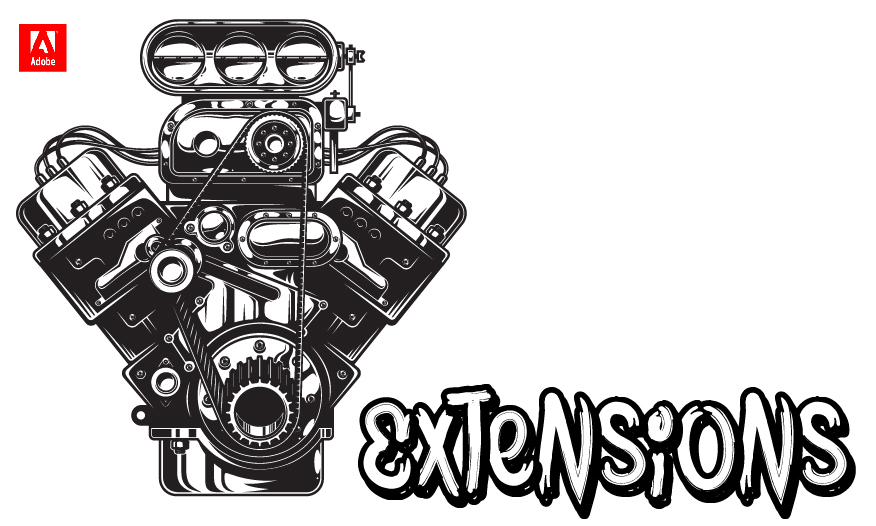
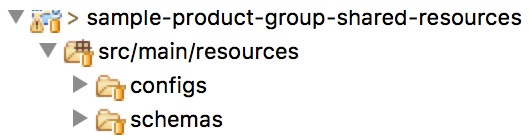
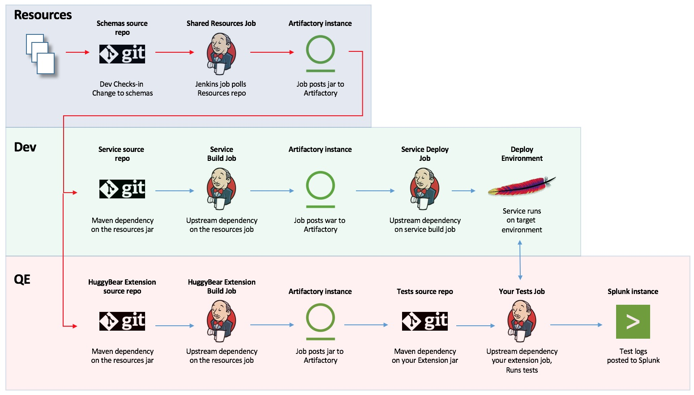
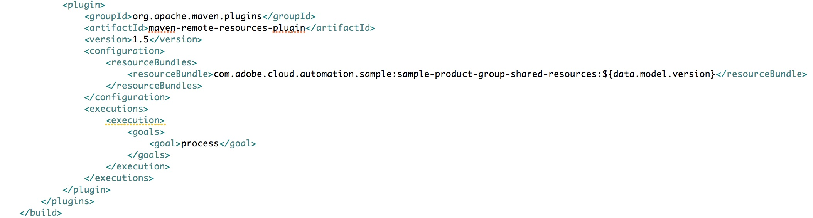
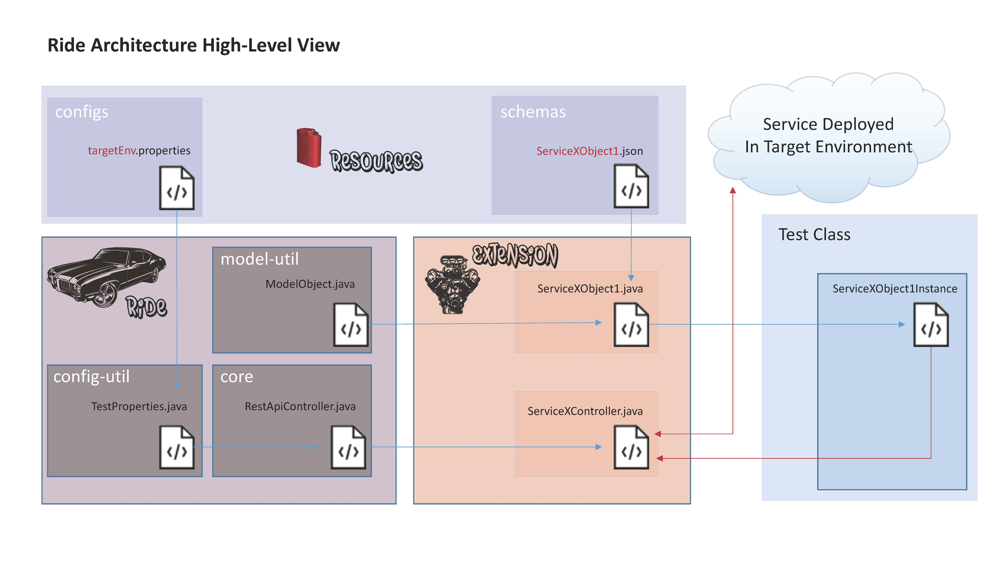

# Extending Adobe Ride


* [Overview](#overview)
* [Setting up your environment configurations](#creating-environment-configs)
* [Creating Your Shared Resources Repo/Jar](#creating-shared-schemas)
* [Extending Ride](#extending-ride)
* [The Fuzz](#the-fuzz)
* [Test Groups](#test-groups)
* [Authenticated Calls](#authenticated-calls)

## Overview

This document is intended to show a few samples of how to extend Adobe Ride in order to use it for testing your service.  The examples in the [ Samples](sample/) folder will be referenced in this document, but pulling the samples and building them and running against the sample service may be more instructive.  Use the samples as a guide on how to create your own Ride Extension.

There are two main things you need to think about for creating a Ride Extension which will support the testing of the REST API service you support:
1. A java project which contains the schemas and properties files which define the datamodels and environment endpoints for testing your target service.
2. A java project which consumes the jar created from the project in point one and has a dependency on the Ride framework.

When you have these setup up and building properly, you will have a library (a.k.a. your Ride extension) which will provide the methods necessary to write tests which target the API service you support.

This document will go through the step-by-step process of creating these and making you have your infrastructure setup to support your tests.

## Shared Resources
The Shared Resources described in point 1 above is a standard java maven project, with the exception that it only contains files in the src/main/resources folder, because the project only contains resources.  

To get started, create a repo in the git org in which the target service source lives.  The recommended values for your share schema project are as follows:

Repo Name/Project Name/maven pom artifactId: <hyphenated broad project name (i.e. my-company-service-area-name)>-shared-resources
Maven pom groupId: some.company.domain.name.automation.<broad project name>

It is generally recommended that you use best programming practices when developing all of your extension components (i.e. the triangle development model): Fork this repo to your personal git org.  Then clone that personal repo to your local machine.  The idea is you push new code to your fork and then open PRs from your fork to the repo in the central git org (which enables code reviewing and improved standards).

When you have this setup, create a new maven project in the IDE of your choice, targeting the folder when you cloned your git fork project.  In the src/man/resources folder, create "configs" and "schemas" folders.  When done you should have something like this:

<p width="100%">
	
</p>
<br/>
<br/>
<br/>
<br/>
<br/>


### Creating Environment Configs
Part of the way you define how Ride (and your extension) interacts with your service is through an environment configuration.  In this project, you'll create java .properties files, which define the components of the core URL for each of the environments on which your service runs, to include:

	* endpoints
	* ports
	* protocols
	* base paths
	* other environment specific configurations
	
This information will make it easy for your tests to switch between different environments.

To start, in the configs folder, create a localhost.properties file.  This file will define how your tests will access a server running on your localhost webserver.  In this file, you will declare the service(s) for which you are providing configuration details, and the configuration details themselves.  The code sample below shows the configuration for two services

```
declaredServices=SampleService,OtherSampleService
isProduction=false

//sample service
SampleService.schema=http
SampleService.port=8080
SampleService.endpoint=localhost
SampleService.basePath=/sample-service-server/rest

//other sample service
OtherSampleService.schema=http
OtherSampleService.port=8080
OtherSampleService.endpoint=localhost
OtherSampleService.basePath=/other-sample-service-server/rest
```

This config file, when invoked by Ride, will create a target service URL of http://localhost:8080/sample-service-server/rest for the "SampleService" declared service for the tests that run it.

*Important Note:* It is not required to place this config information in a separate jar.  If your dev partner doesn't need to access this information outside of running the functional/integration tests, or you don't believe there is a need for cross-service integration, you could simply place the config folder directly in the resources folder of your Adobe Ride extension you will create (discussed later in this document). 

### Creating Shared Schemas

The most important parts of your shared resources are the schemas.  These represent the REST API body payload that's acceptable to the service.  By providing these, you are letting Ride know what data sent should return a positive response (2xx) and a negative (400).  By externalizing these schema in a separate jar, you are able to pick up changes that your dev(s) or other test colleagues make(s) import them into your project dynamically, and test them in your functional and integration tests automatically.  This assumes your dev/service project has a shared resources built job that generates a jar based on git polling and you both have dependencies on that jar (in a maven SNAPSHOT worfklow).  

The diagram below shows how the shared-resources jar build structure should look to make sure your tests automatically test changes as they happen.  The red arrows shows the build flow to ensure the shared resources get into both the service sources and your HuggBear extension



Currently, the datamodel for any object must be defined by a JSON schema.  This is because the [JSON schema](http://json-schema.org/) standard is strong in its rigor, fueling more precision in generation of valid data and testing the server data handling.  Also, because the data in a protobuf can be JSON-like, a JSON schema can define what is compiled into a protobuf message as well.

In terms of the consumption of the JSON schema, the ModelObject class in the model-util has the ability to read a schema of almost any complexity and generate valid data for any object to be used in a REST call.  When you create your Ride extension, you will create java classes (pojos) which map to the data models (JSON schema) that you support, and these classes will sub-class the ModelObject.  When you create instances of your object classes, the ModelObject will generate valid data for the object, which can then be passed to the controller classes in the Ride core.  This is also discussed later in this document.

Samples of what a JSON schema might look like are in the samples in the Ride git repos, but you can also reference the JSON-schema website linked above.

*Important Note:* Sometimes, the organizational structure of your development team doesn't allow for the schemas to live outside of their source repo.  That's ok, you'll just need to add a pom to their repo which builds only the schemas into a jar (through exclusions in the pom).  The model is essentially the same in effect.  You will have a jenkins job to fire the pom and post the artifact which you will rely upon.

### Importing the shared resources into your Extension project

While these config and schema documents do live outside of your project, fortunately, maven provides a simple way to get them into your extension project (and the server source) - the [maven-remote resources-plugin](http://maven.apache.org/plugins/maven-remote-resources-plugin/).  You simply need to modify your Extension (and server) pom.  In the build node of your  pom, you will add a plugin node which will utilize the maven-remote-resources-plugin to import the shared schemas jar.  Below shows what your Extension pom modification will look like:




## Extending Ride

### Naming your extension
Now that you have your shared resources set up, you can begin building your service extension. Similar to the way you created, forked, and cloned your shared-resources repo, you will do the same for your Ride extension.  The values for your extension id points are as follows:

Repo Name/Project Name/maven pom artifactId: <hyphenated service name>-automation-library
Maven pom groupId: com.adobe.cloud.automation.<hyphenated broad service area name>


### Examining the Samples
In the /samples folder of the Ride repo, if you look at the sample-service-extension, you'll see three packages (excluding the full package path):

- cloud\_objects
- core
- types

Let's start by looking at cloud\_objects.  The files in this package map directly to the objects in the sample-service-shared-resources schemas.  They are more or less java representations of the schemas. Because they are java classes, you can use the power of java for abstraction to remove repetitive code with custom methods.  This in turn allows you (and those that use your extension) to develop tests faster.  And because all of the classes in this package sub-class the model object, the data for the object can be generated automatically (and fuzzed automatically - discussed later).

In the core package, there is one class called "SampleServiceController".  This class is a subclass of the RestApiController in the Ride core.  This is where the bulk of the normally repetitive rest-assured groovy syntax that appears in tests will be abstracted.  It overrides calls like put, post, and get which are in the core to pass in things which are common to most calls your tests would make to your service, like Content-Type and Accepts headers.  Again, the idea is to remove repetitive stuff like that out of your tests and place it in files like this.

The last package in the project is the types package.  There are two classes in here, both of which are enums.  They "CloudObjectType" is a list of enums which map to the java representation of the service types.  This is standard java best practice to reduce errors caused by typos.  The other is "SERVICE", another enum, this one referring to the list of declared services in your config properties files.

These packages and their classes, this structure, represents the core of what you will need to build for your Ride extension.  This is a very simplistic example, intentionally for the purposes of learning.  You will build your extension out beyond that to establish a useable library for you and others to drive testing of your target service.

Now let's look at a diagram that shows the linkages we've discussed so far:

### Extension Diagram


### Hooking up with the Schemas
We'll talk about the "configs" portion of the diagram in a moment, but for now let's discuss the schemas flow that starts in the middle of the diagram at the top.  This shows one of the schemas in the schemas folder and how it is being consumed by its relative java representation in our extension.  So what does this look like in the code?  Let's take a look at one of the constructors for our java object in the samples:

```

	public SampleServiceUberObject(CloudObjectType type, String objectName, boolean initRequiredOnly)
	    throws UnexpectedModelPropertyTypeException, UnexpectedModelDefinitionException, IOException,
	    ParseException {
		super(Service.SAMPLE_SERVICE, type.toString(), objectName, initRequiredOnly);
		buildValidModelInstance();
    	}

```

Because this class subclasses the ModelObject, it calls the super constructor in its own constructor in order to take advantage of the data generation that the ModelObject provides.  While the ModelObject constructor is overloaded, the signature utilized above is the most commonly used.  There are four required arguments here:  

- *Service* - this is passed as a const and refers not only to the service your are testing, but more importantly, the name of the folder in which the JSON schema representation file lives in the shared resources., String objectType, String objectName, boolean useRequiredOnly
- *ObjectType* is not only the name of the object, but a reference to the file name of the json schema which represents the type.  These first two arguments are mappings back to the schema we wish to use.   
- *ObjectName* argument is for syncing purposes.  Currently, the ObjectType and ObjectName properties will build an objectPath property in the instance.  It is not called automatically in your REST calls, but is there for convenience. It can be reset manually, or even overridden in your classes. 
- *initRequiredOnly* is a boolean which refers to the standard json schema property which identifies properties which must be defined when instantiating an object.  A value of true will only generate data for required properties and stop there (i.e. the object instance will have only these properties present).  A value of false will generate all values for the object.

Now that we have provided values for our object, we can call the core functionality of the ModelObject to build data for our instance with buildValidModelInstance().  Once we have done that, we have an object that is ready to be passed to our service.  

### Starting to Leverage Extension in Tests
Let's take a look at how this is done from our sample test class:

```

	private static Base base = Base.INSTANCE;

    @Test(groups = {"smoke", "acceptance"})
    public void runBasicTest() throws UnexpectedModelPropertyTypeException, UnexpectedModelDefinitionException,
	    IOException, ParseException {
		String itemName = UUID.randomUUID().toString();
		SampleServiceObject1 testObject = new SampleServiceObject1(itemName, false);
		testObject.setProperty("name", "fred");

		SampleServiceController.createOrUpdate(testObject.getObjectPath(), testObject, base.CREATED_RESPONSE);

    }

```

The first line in the snippet is a reference to a base singleton class in our test project which you may find useful to have in your own.  It houses common values and can be used in conjunction with authentication to make for easy token re-use (discussed later).

The second line is a TestNG annotation which lets TestNG know that this is a test method, and is to be run when invoking the smoke or acceptance groups.  How to invoke different test groups is discussed later in this document.

The important lines in this snippet start when from the constructor invocation.  In this case, we are calling a subclass of the SampleServiceUberObject, which automatically passes the object type in it's constructor (examine the samples), so all we need are the object name, and whether we want all properties generated.  From there we alter the data the was dynamically generated (changing the name property), and then statically calling a method in a class called SampleServiceController.  If you refer back to the last diagram, you can see how we instantiated something similar ServiceXObject1Instance1 (the diagram is intentionally generic), and then pass that object to ServiceXController, which is similar to our SampleServiceController in the code above.  The arguments we are passing are the REST API path (which in this cases, is the object path), the object itself, and the response we expect to get back frmo the server, which will cause the test to either pass or fail).  Because this is subclassed from the RestApiController in the Ride, our createOrUpdate(...) method in our controller leverages the built in rest-assured methods in the core, in this case the put(...) method:

```

	public static Response createOrUpdate(String objectPath, SampleServiceUberObject object, ResponseSpecification expectedResponse) {
		RequestSpecBuilder reqBuilder = getDefaultReqSpecBuilder();
		reqBuilder.setBody(object.getObjectMetadata());
		return put(SERVICE.SampleService, objectPath, reqBuilder, expectedResponse);
    }

```

Let's look at the arguments in the put call.  We pass through the path and the expected response.  We get the generated model data from the object we passed and set it as the body of a RequestSpecBuilder object sent into the core.  An explanation of the rest-assured RequestSpecBuilder is beyond the scope of this document.  For more information on this class, please see [this](http://static.javadoc.io/io.rest-assured/rest-assured/3.0.3/io/restassured/builder/RequestSpecBuilder.html).

### Hooking up with the configs
We also pass the name of the service, one of the constants in the Service enum that we identified earlier in our types package, which maps back to the services we declared in our config properties file.  This is how the controller knows where to send the data that we've constructed so far.   If you look at our diagram again, we can see how the linkage from the configs shared resources through the config-util to our controllers looks at a high level.

But how does Ride know which environment we are using?  Through a "target" command line argument.  This is what your command line argument might look like:

```
mvn verify -Dtarget=prod01
```

The value here is the name of the config file that you created and are targeting.  The name of the file should reflect the environment you are targeting.  When running from Eclipse, you need to place the argument into the TestNG configuration values as shown in the screenshot below:


### Putting it all together
If we look at the information we've reviewed, we can conclude there that there are two flows of information that start from our resources that drive our extension through to our REST API call

- Configs define environments which provide information to the controller for where to send the data
- Schemas define what the objects should look like, which inform the java classes in your extension and house the data which the controller will send.

These two flows of information form the basis for data flowing through your extension from your tests to your target service.

## The Fuzz
One of the most powerful features of Ride is the fuzzer.  The fuzzer takes an array of data, some of it corner cases, some of it edge, some of it quasi-malicious and attempts to see if your service is handling it properly based on the datamodels defined by the schema.  This removes the need for you to generate a good chunk of the negative and edge tests manually, and allows you to focus on real-world data flows for your service, high-value testing.

The good news is that if you have set up your Ride extension, utlizing the fuzzer is almost trivial.  Here's what the Fuzzer test looks like in our sample project:

```

@TargetService(Service.SAMPLE_SERVICE)
public class Basic_FuzzTest_IT {

    @TargetService(Service.SAMPLE_SERVICE)
	public class Basic_FuzzTest_IT {

    	// private static Base base = Base.INSTANCE;

    	@Factory
    	public Object[] fuzzObjectMetadata_IT() throws Exception {
			String itemName = UUID.randomUUID().toString();
			SampleServiceObject1 object1 = new SampleServiceObject1(itemName, false);
			return new Object[] { new MetadataFuzzer(this.getClass(), object1) };
    	}
	}

```
The fuzzer test leverages the MetadataFuzzer class in the fuzzer-lib.  The test code here looks very similar to the BasicTest discussed earlier, with the following notable exceptions:

- In this case the testclass is annotated, because we are not going through the extenstion we created, but the fuzzer.
- We annotate the test with @Factory  instead of @Test, which is required by the fuzzer.
- We pass the object we instantiated to the MetaDataFuzzer instead of to a controller.

With this small number of lines of code, in this sample instance we are able to generate 500+ tests which run in a few seconds and test a range of boiler plate data, SQL and NoSQL injection strings, and a host of other things that would be painful to write manually.


## Test Groups
Often TestNG tests are organized by an xml config file.  We find this is terrificly wasteful and hard to maintain.  It is much easier to place a test group annotation on the tests themselves, and control which tests are run in various Jenkins jobs through Maven build profiles.  You set these profiles in the pom of your test project.  The following is an example of how you would make a build profile for the smoke annotation we added in our test snippet above.  We specifically exlude the Fuzzer tests since the sniffing in TestNG wasn't quite designed to work with the @Factory annotation this way and we only want to run the smoke tests.  We'll run the Fuzzer tests in a separate jenkins job.

```

	<profiles>
		<profile>
			<id>smoke</id>
			<activation>
				<activeByDefault>false</activeByDefault>
			</activation>
			<build>
				<plugins>
					<plugin>
						<groupId>org.apache.maven.plugins</groupId>
						<artifactId>maven-failsafe-plugin</artifactId>
						<version>2.18.1</version>
						<configuration>
							<groups>smoke</groups>
							<encoding>${project.build.sourceEncoding}</encoding>
							<excludes>
								<exclude>**/Fuzz*.java</exclude>
							</excludes>
						</configuration>
					</plugin>
				</plugins>
			</build>
		</profile>
		...
	<profiles>

```
The profile id maps back to the tests with the same groups id values in it's test annotations.  To invoke it, another command line flag is required, and so your jenkins command line might look something like this:

```
mvn verify -Dtarget=stage01 -Dprofile=smoke

```

## Authenticated Calls

Often REST API calls will need to be Authenticated.  However, authentication schemes vary widely by company.  We have tried to make allowances for authentication by adding arguments about whether to add a token to a service call, or not.  In the Ride core, there is a check which utilizes a rest-assured Filter class.  This checks to see if there is already an Authorization header added to the call, and if it is not present, it attempts to add one.  However, again, and with good reason, these company-specific authentication details are kept secret and you will need to do a bit of work here to determine how to add authorization to your call.


## Final Note

The samples discussed here are again, just that, samples.  They are simple and meant to be illustrative on how you get started.  Ride is designed to give REST API testers a platform to use java best pratices in their automated test writing, allowing them to be more efficient with their code, and create more maintainable and shareable tests.  The way you know that you're using Ride fully, is if you find there is very little duplicated code in your test classes and that others are able to use your extension for complex workflows that validate real world use cases.

Finally, Ride is an opensource project.  If you find that your have improvements in mind for the core of the framework, feel free to open Pull Requests and ping the framework owners (currently Ted Casey) for a review.  Conversely, if you see a need for an improvement, you can post a git issue in the repo, and as bandwidth allows, the framework owners will address them.

Good luck and Happy Testing!


